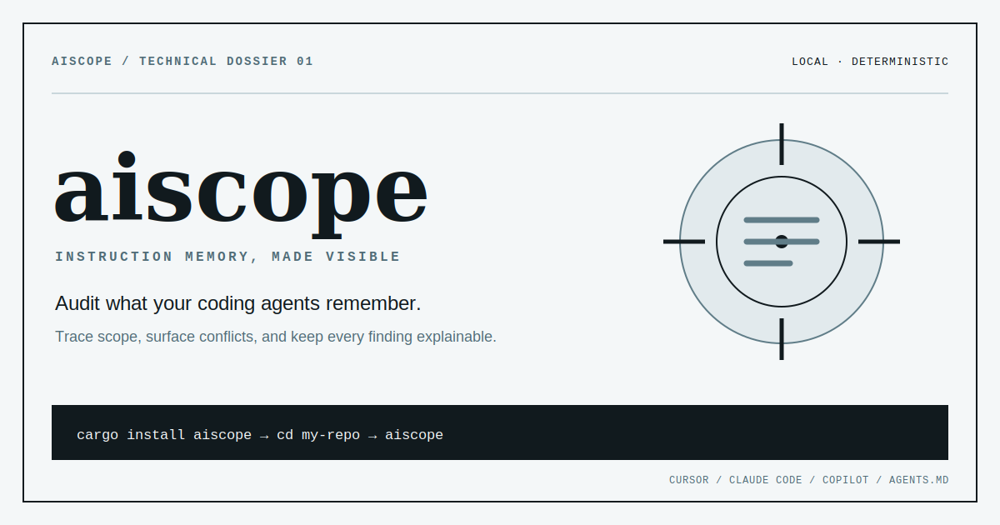
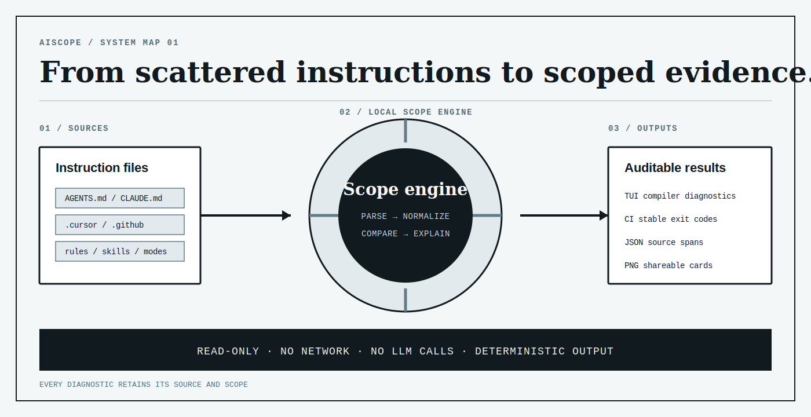

<p align="center">
  
</p>

<h1 align="center">aiscope</h1>

<p align="center">
  <strong>DevTools for your AI coding tools' memory.</strong><br>
  See what Cursor, Claude Code, and Copilot actually remember about your project — and where they disagree.
</p>

<p align="center">
  <a href="https://crates.io/crates/aiscope"></a>
  <a href="https://github.com/jayanth-mkv/aiscope/actions/workflows/ci.yml"></a>
  <a href="LICENSE"></a>
  <a href="https://jayanth-mkv.github.io/aiscope/"></a>
</p>

<p align="center">
  <a href="#what-is-aiscope">What is AIScope?</a> ·
  <a href="#quick-start">Quick start</a> ·
  <a href="#features">Features</a> ·
  <a href="#architecture">Architecture</a> ·
  <a href="#privacy--safety">Privacy</a> ·
  <a href="#install">Install</a>
</p>

<p align="center">
  
</p>

## What is AIScope?

`aiscope` is a local audit tool for the instruction files used by Cursor, Claude Code, GitHub Copilot, and compatible agent workflows. It discovers rules, prompts, agents, chat modes, and skills, then shows which instructions overlap or conflict.

The analysis is deterministic and read-only: no LLM calls, network requests, telemetry, or account. Results are available as an interactive terminal UI, compiler-style diagnostics, JSON, text, CI exit codes, and a shareable PNG card.

<p align="center">
  
</p>

## Quick start

```bash
cargo install aiscope
cd my-repo
aiscope
```

---

## The problem

You probably run 1–3 AI coding tools side-by-side: Cursor, Claude Code, Copilot, Cline, Aider… Each one stores its memory in **multiple private dotfiles** that nobody ever opens after writing them:

```text
GitHub Copilot:
  .github/copilot-instructions.md
  .github/instructions/*.md           (per-glob applyTo)
  .github/prompts/*.prompt.md         (slash commands)
  .github/chatmodes/*.chatmode.md
  .github/agents/*.md
  AGENTS.md                           (any depth, path-scoped)

Cursor:
  .cursorrules
  .cursor/rules/*.{md,mdc}
  .cursor/commands/*.md
  .cursor/agents/*.md
  .cursor/modes/*.md

Claude Code:
  CLAUDE.md                           (any depth, path-scoped)
  .claude/agents/*.md
  .claude/commands/*.md
  .claude/skills/*/SKILL.md
  ~/.claude/CLAUDE.md                 (with --user)
```

Even if you only use **one** tool, you have rules in 5 places. After six months you have **stale rules, contradicting rules, scope-mismatched rules, and rules that silently override each other** — and you can't see any of it.

`aiscope` reads them all, classifies them by **subsystem** (instructions / prompts / agents / chatmodes / skills), respects **scope** (`applyTo`, `globs`, `alwaysApply`, path-derived prefix), and flags conflicts with compiler-grade source spans.

---

## Features

| Feature                    | Flag                         | What it gives you                                                   |
| -------------------------- | ---------------------------- | ------------------------------------------------------------------- |
| Conflict detector          | (default)                    | Points to exact `file:line` where rule X disagrees with rule Y      |
| Subsystem-aware mode       | `--specific`                 | Drops false positives between prompts, instructions, agents, skills |
| User-scope memory          | `--user`                     | Also reads `~/.claude/CLAUDE.md` and other cross-repo files         |
| TUI                        | (default)                    | Two-pane terminal app: sources left, conflicts right                |
| Compiler-grade diagnostics | `--diag`                     | `miette`-style report with byte-precise spans for CI logs           |
| Token-budget breakdown     | (always)                     | "21% of your context window is stale"                               |
| Shareable PNG card         | `--card out.png`             | Portable audit summary for issues, posts, and retrospectives        |
| CI mode                    | `aiscope check`              | Exits 1 only on **high-severity** conflicts (no flapping)           |
| Watch mode                 | `aiscope watch`              | Live re-scan on file change                                         |
| Scriptable                 | `--json`, `--text`, `--grep` | Pipeable into anything                                              |

---

## Architecture

<p align="center">
  
</p>

AIScope is a six-layer deterministic pipeline. **No LLM calls. No network. ~5 MB binary.**

```text
Source files (3 tools × 5 subsystems)
   │
   ▼ Layer 0  scanner          → (Source, raw text)
   │   ├─ Copilot:  .github/{copilot-instructions, instructions/, prompts/,
   │   │            chatmodes/, agents/} + AGENTS.md (any depth, path-scoped)
   │   ├─ Cursor:   .cursorrules, .cursor/{rules,commands,agents,modes}/
   │   └─ Claude:   CLAUDE.md (any depth), .claude/{agents,commands,skills}/
   │
   ▼ Layer 0.5 frontmatter     → Scope { globs, alwaysApply, model, tools }
   │   ├─ Copilot applyTo:  "**/*.ts"
   │   ├─ Cursor  globs:    ["**/*.rs"]
   │   ├─ Cursor  alwaysApply: true
   │   └─ Path-derived:    apps/web/AGENTS.md → "apps/web/**"
   │
   ▼ Layer 1  parse            → Statement (one bullet/paragraph + byte span)
   │   pulldown-cmark CommonMark AST; skips code blocks, headings,
   │   blockquotes, HTML, YAML frontmatter; preserves inline code.
   │
   ▼ Layer 2  canonicalize     → CanonicalText
   │   NFKC + smart-quote/dash → ASCII + Unicode caseless fold +
   │   punctuation strip + Snowball stem (preserves snake_case identifiers).
   │
   ▼ Layer 3  pattern extract  → Assertion { axis, value, polarity, condition }
   │   Polarity (Forbid/Prefer/Allow) + clause splitter + condition extractor +
   │   10 axes with topic-gating. Confidence 0.85–0.97 per match.
   │
   ▼ Layer 4  reason           → Conflict { kind, severity, confidence }
   │   ├─ Duplicate (cross-source SHA-256 fingerprint)
   │   ├─ Clash (same axis, both Prefer, different values)
   │   ├─ PolarityConflict (same value, opposite polarity)
   │   └─ DuplicateName (agent/skill/chatmode `name:` collision)
   │   Severity = High iff cross-source AND conf≥0.85 AND scopes overlap.
   │
   ▼ Layer 5  render           → TUI / miette diag / JSON / PNG card
```

### Two reasoning modes

- **Uniform** _(default)_: every cross-file pair is a candidate conflict. Subsystem boundaries are ignored. Best for "show me everything that _could_ contradict".

- **Specific** _(`--specific`)_: subsystem-aware. Prompts ↔ Instructions never conflict (different intent). Agents ↔ non-Agents never conflict (isolated runners). Skills/ChatModes only check duplicate names + tool allowlists. Best for low-noise CI.

### Scope-aware severity

Two rules with **non-overlapping** `applyTo` globs (e.g. `**/*.ts` vs `**/*.py`) still surface as conflicts — but downgraded to `Severity::Low` with a `(scopes don't overlap)` note. `aiscope check` ignores them; the TUI shows them.

---

## Privacy & safety

- **Read-only.** Never modifies your files.
- **Local only.** No telemetry, no network, no account, no API key.
- **No session-log access.** v0.1 will not open `~/.claude/projects/*.jsonl` (chat history). Only rules and instruction files. Enforced by [tests/privacy_guard.rs](tests/privacy_guard.rs).
- **No TLS interception.** Not a proxy. Just walks your dotfiles.

---

## Install

```bash
cargo install aiscope            # 5 MB self-contained binary
```

(Pre-built binaries shipping in v0.1.1 via GitHub Releases.)

---

## Usage

```bash
aiscope                          # TUI in current dir
aiscope --diag                   # compiler-grade report for CI logs
aiscope --card out.png           # 1280×720 PNG of the TUI for sharing
aiscope --json | jq              # scriptable
aiscope --grep "snake_case"      # filter rules
aiscope --specific               # subsystem-aware (low-noise mode)
aiscope --user                   # also read ~/.claude/CLAUDE.md
aiscope check                    # CI: exit 1 on high-severity conflicts
aiscope watch                    # live re-scan
```

### CI

```yaml
# .github/workflows/aiscope.yml
- run: cargo install aiscope
- run: aiscope check
```

---

## Tech stack

| Crate                                | Role                                                  |
| ------------------------------------ | ----------------------------------------------------- |
| `pulldown-cmark`                     | CommonMark AST with byte offsets                      |
| `unicode-normalization` + `caseless` | Unicode-correct fold (Turkish-safe)                   |
| `rust-stemmers`                      | Snowball stem for paraphrase-resistant fingerprinting |
| `regex`                              | Polarity / axis pattern matching                      |
| `globset`                            | `applyTo` / `globs` overlap test                      |
| `miette`                             | Compiler-grade diagnostics                            |
| `tiktoken-rs`                        | OpenAI BPE tokenizer for token-budget math            |
| `tiny-skia` + `cosmic-text`          | PNG card (pure Rust, no headless browser)             |
| JetBrains Mono                       | Embedded monospace font (270 KB, Apache-2.0)          |
| `ratatui` + `crossterm`              | TUI                                                   |
| `clap`                               | CLI                                                   |
| `insta`                              | Snapshot determinism gate                             |

---

## What to test

```bash
# 1. All unit + integration tests (42 tests across 5 binaries)
cargo test --all

# 2. Lint
cargo clippy --all-targets -- -D warnings

# 3. Release build
cargo build --release

# 4. Live demo against the bundled Copilot-only fixture
cargo run --release -- --diag .\tests\fixtures\copilot-only
cargo run --release -- --card demo.png .\tests\fixtures\copilot-only
cargo run --release -- check .\tests\fixtures\copilot-only; echo $LASTEXITCODE
cargo run --release -- --specific --diag .\tests\fixtures\copilot-only
```

### Fixtures shipped in the repo

| Fixture                                   | Tests                                              |
| ----------------------------------------- | -------------------------------------------------- |
| `tests/fixtures/{cursor,claude,copilot}/` | Three-tool cross-conflict (smoke test)             |
| `tests/fixtures/copilot-only/`            | Single-tool repo with all 5 subsystems             |
| `tests/corpus/negation_clause.md`         | "Don't X, prefer Y" → 2 clauses, no self-clash     |
| `tests/corpus/historical_narrative.md`    | "We migrated from npm to pnpm" → 0 false positives |
| `tests/corpus/conditional_clauses.md`     | "snake_case in legacy, camelCase in new"           |
| `tests/corpus/frontmatter_and_code.md`    | YAML + code blocks + blockquotes all skipped       |
| `tests/corpus/multi_axis.md`              | Indentation + comments + imports in 3 lines        |

Snapshots are pinned in `tests/snapshots/`. To accept intentional changes: `cargo insta review`.

---

## Roadmap

- v0.2 — `semantic` feature: fastembed paraphrase recall, MCP server inventory, opt-in session-log scanning, git-aware memory diff
- v0.3 — `aiscope traffic` proxy mode (live cost monitoring)
- v0.4 — hosted shareable snapshot URLs
- v0.5 — cross-tool memory port (`aiscope port cursor → claude`)

## License

MIT (aiscope source) · Apache-2.0 (embedded JetBrains Mono font)
